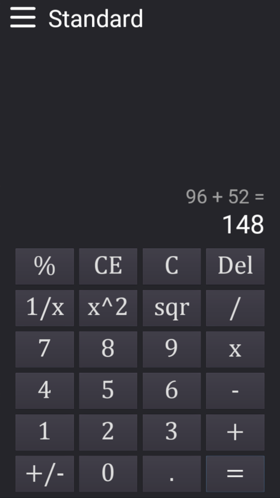

# Phone-Calc
A phone calculator made in Godot using combination of GDScript and C#

### About
-------------
This is my first mobile app made in Godot v3.5.1. It was made using both GDScript and C#. It was inspired by Windows 10/11 Calculator app.  
It features 3 main types of calculators:
<ul>
  <li>Standard</li>
  <li>Scientific</li>
  <li>Date Calculator</li>
</ul>

It also features a lot of converters for different types of values like:
<ul>
  <li>Angle</li>
  <li>Area</li>
  <li>Currency</li>
  <li>Data</li>
  <li>Energy</li>
  <li>Length</li>
  <li>Mass</li>
  <li>Power</li>
  <li>Pressure</li>
  <li>Time</li>
  <li>Velocity</li>
  <li>Volume</li>
</ul>

Being quite novice in this, I made the fatal mistake of not using inherited scenes for calculators. Which is why the source code looks as it does. I wouldn't ever recommend anybody doing this the way I did. Use inheritance. 
I am also unsure if my way of storing convertions from one value to others is correct. On one hand, I thought about using actual formulas, but thought it would take way too long. Well, I can quite confidently say that my method was not very fast either. At least I think it should make up for it by having an easy way to fix wrong values.  

As always, I did some small clean up and added comments but I haven't made any significant changes to the code.  
I uploaded this repo and preserved the game for me to look at how much I improve over time. Improving the code now, with my current knowledge defeats the point.  
However, you're free to improve upon this code if you wish to do so :)

### Getting Started
-------------
To compile this project, you will need at least Godot Mono v3.5.1. Do not forget you will need the required export templates. This app was made with Android in mind specifically. I'm sure exporting it to iOS would work too, but having no Apple device, I cannot test this.   
More in-depth guide is avaiable here: https://docs.godotengine.org/en/stable/tutorials/export/exporting_projects.html  
You're free to modify the project as you wish.

### Credits
-------------
Fonts used were:
<ul>
  <li>Cambria Math</li>
  <li>Roboto Regular</li>
  <li>Montserrat Bold</li>
</ul>
I also used modified version of Dark theme for Godot by Mounir Tohami (https://mounirtohami.itch.io/godot-dark-theme)

### Preview
-------------

